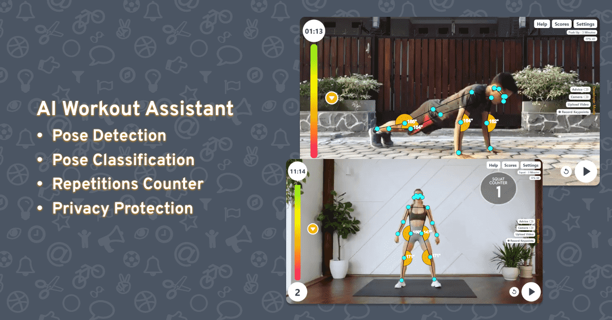
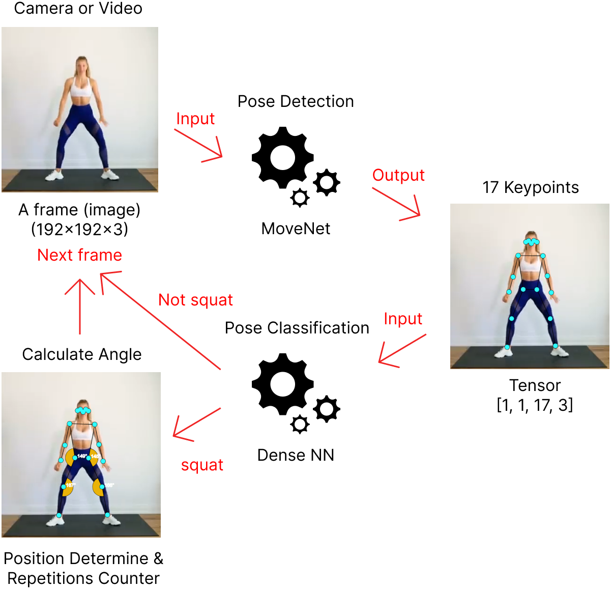

# AI Workout Assistant

An web application to help everyone do workout wherever and whenever. Supported by the pose detector feature to analyze every pose and auto count the number of repetitions made. So, let's create a healthy life by do workout every day!



Pose Detector and Classification in the AI Workout Assistant application fully runs on the Client side, so no image data comes out of the user's device. Videos or images processed by the program will be automatically deleted.

## How it Work

Image data which is obtained from video or webcam will be processed by pose detector using the MoveNet model to generate keypoints. Keypoints are used for repetition calculations and input for classifying workout types with Dense Neural Network (DNN) model.



## How to Run Locally

- Prerequisites: you'll need to have [Git](https://git-scm.com/), [Node](https://nodejs.org/), and [NPM](https://www.npmjs.com/package/npm) installed and running on your machine.
- Open terminal/powershell/command prompt then clone this repository
  ```Bash
  git clone https://github.com/kevinrp22/ai-workout-assistant.git
  cd ai-workout-assistant
  ```
- Install dependencies
  ```Bash
  npm install
  ```
- Once the installation is done, you can run the app locally
  ```Bash
  npm run start-dev
  ```
- Then open http://localhost:8080 to see your app.
